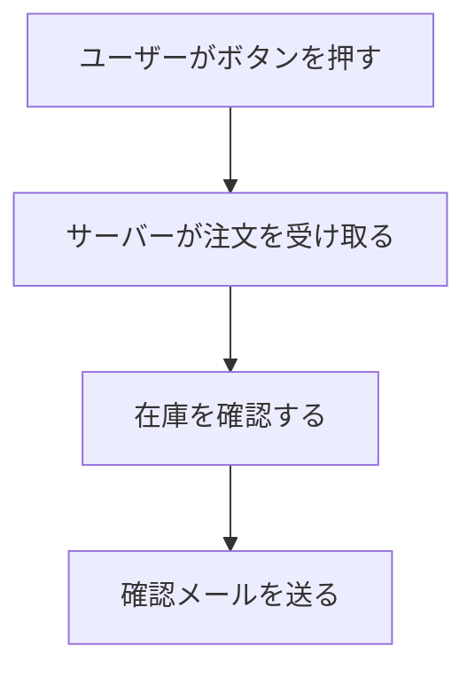
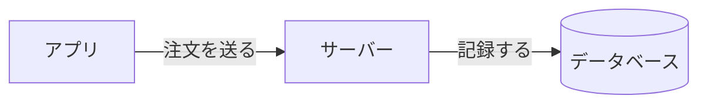
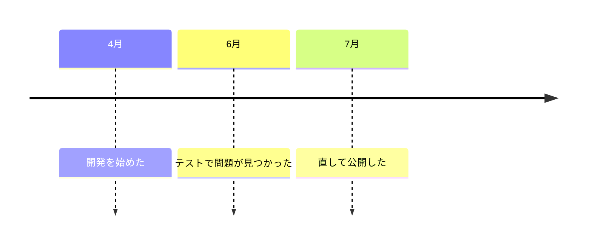

# Diagram Catalog

Pick the diagram from the shape of the content. Two limits apply to every shape: **at most 5
elements**, and **one message per diagram**. When the content is bigger than that, drop elements
or split into two diagrams. Never grow one diagram.

## Procedure / sequence → flowchart

For "first this happens, then that". Top to bottom, one arrow per step. Add a branch only when
the branch *is* the message.

## Things and relationships → block diagram

For "A talks to B, B stores into C". Use `flowchart LR`: boxes for things, labeled arrows for the
relationship. If an arrow needs a long label, that text belongs in a point, not in the diagram.

## Choice between options → comparison table

A table *is* the diagram for comparisons. Rows are options. Columns are the 2–3 things the
decision turns on. Mark the recommended row in words ("←おすすめ"), not only by position.

| 案 | 手間 | 危険度 |
|---|---|---|
| 一度に直す | 小 | 高い |
| 二回に分けて直す ←おすすめ | 中 | 低い |

## Sizes and proportions → bar lengths

For "A is much bigger than B". Rough bars in a table beat exact numbers the reader cannot feel.
Round hard; the message is the ratio.

| 処理 | かかる時間 |
|---|---|
| 画像の読み込み | ████████ 8秒 |
| その他すべて | █ 1秒 |

## Things over time → timeline

For "this happened, then a week later that". Use Mermaid `timeline`, or a flowchart with dates in
the labels when the renderer may not support `timeline`.

## Rules for every diagram

- **One message.** Ask: "What single sentence does this diagram prove?" If the answer has an
  "and", split the diagram.
- **Five elements.** Boxes, rows, bars, or events — 5 is the ceiling.
- **Everyday labels.** The wording rules apply inside the diagram too. A diagram full of jargon
  is the original message in boxes.
- **No decoration.** No colors for their own sake, no icons. The shape carries the meaning.
