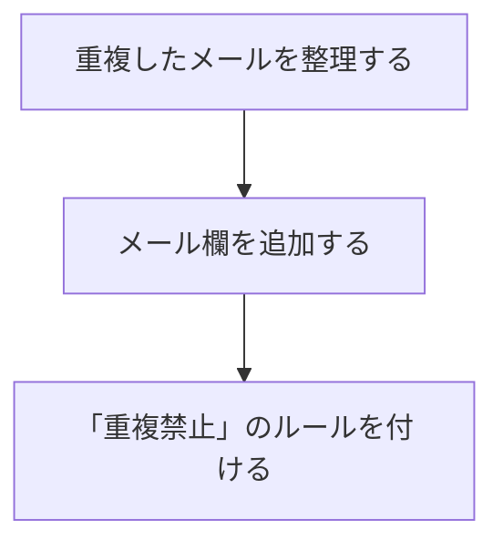

# Output Format

Every plain version has the same four parts, in this order. Nothing comes before part 1 and
nothing comes after part 4.

## Skeleton

````markdown
**つまり**:<conclusion in one sentence>

<diagram (1–2, Mermaid preferred)>

**ポイント**
- <point 1>
- <point 2>
- <point 3>

**ことば**
- **<term>** … <one-line everyday explanation, with an analogy>
````

Match the headings to the output language (`**In short**` / `**Points**` / `**Words**` in
English). The parts and their order never change.

## Part rules

### 1. Conclusion — one sentence

- About 40 characters in Japanese, about 15 words in English. One sentence, one full stop.
- It answers "so what is this?" or "so what should I do?" — whichever the original message was
  about. If the original recommends an action, the conclusion is that action.
- Do not open with context ("As you asked previously…"). The conclusion is line one.

### 2. Diagram — required

- 1 or 2 diagrams, never more. Use two only when the content has two shapes (for example, a
  procedure *and* a comparison).
- Mermaid is the first choice. A Markdown table is the right "diagram" for comparisons. Use ASCII
  layout only when neither fits.
- **At most 5 boxes, nodes, or rows per diagram.** More than 5 means extraction was skipped. Go
  back and drop elements, or split into two diagrams with one message each.
- Label nodes in everyday words. The same substitution rules as prose apply.

### 3. Points — at most 3

- One sentence per bullet, about 40 characters per sentence.
- Points support the conclusion. Do not introduce topics the conclusion did not touch.
- Order by importance to the reader, not by the original's order.
- Fewer than 3 is fine. Zero is not — with nothing beyond the conclusion, the original did not
  need this skill.

### 4. Words — only what is left

- List only terms actually used above. Do not teach vocabulary the output avoided.
- One line per term: everyday explanation first, analogy after. "**キャッシュ** … 一度調べたことを
  メモしておく仕組み。次に聞かれたとき即答できる。"
- Skip the whole section when no technical term is left. That is the best outcome.

## Worked example

Original (abridged):

> マイグレーション実行時に `users` テーブルへの `email` カラム追加が unique 制約違反で失敗して
> います。既存レコードに重複した email 値が存在するためで、制約を付与する前にデータクレンジング
> を行うか、一旦 nullable で追加してから重複解消後に制約を付与する二段階マイグレーションが必要
> です。なお、本番環境への適用前にステージングでの検証を推奨します。

Good plain version:

````markdown
**つまり**:同じメールアドレスが複数登録されているので、先に重複を片づけないと変更できません。



**ポイント**
- データベースに「同じメールは登録できない」ルールを足そうとして失敗した
- すでに同じメールの人が複数いるため、ルールと矛盾してしまう
- 本番でやる前に、練習用の環境で一度試す

**ことば**
- **マイグレーション** … データベースの作り変え作業。引っ越しの段取り表のようなもの。
````

Bad plain version (do not do this):

> マイグレーションが unique 制約違反で失敗しました。二段階マイグレーションで対応します。

It is shorter, but every hard word is still there. This is shortening, not rebuilding.
